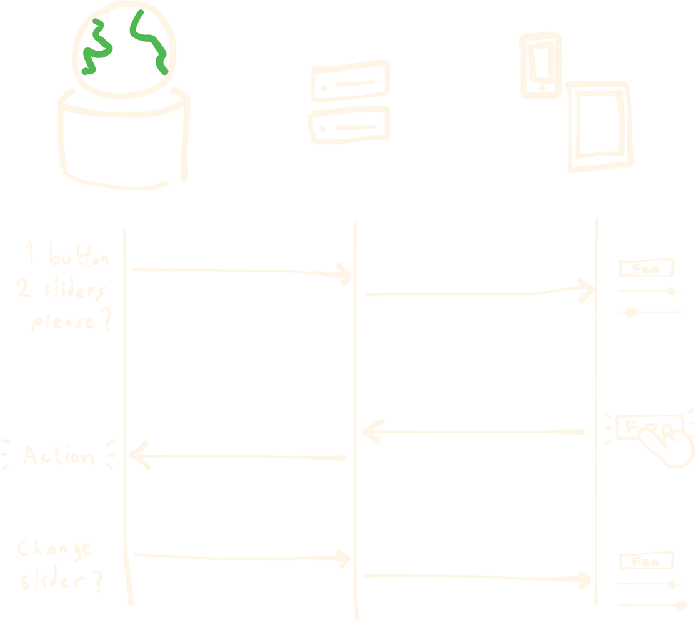

# SocketUI

SocketUI is a remote control system that allows users to control TellUs applications from their smartphone over a local network.

The system consists of a Python WebSocket backend server and a React-based frontend control panel.

## Project Structure

- **`backend/`** - Python WebSocket server
  - See [backend/README.md](backend/README.md) for build and deployment details
- **`frontend/`** - Vite + React control panel
  - See [frontend/README.md](frontend/README.md) for the complete UI configuration protocol and JSON message format
- **`build.bat`** - Build script that compiles the frontend and bundles it with the backend for distribution

## How to Use

Follow these steps to integrate SocketUI into your TellUs application:

1. Build SocketUI (see [How to build](#how-to-build))

2. Run SocketUI.exe and open [http://localhost:7000/](http://localhost:7000/) in your browser

3. Connect your application by creating a WebSocket connection to [ws://localhost:7000/ws](ws://localhost:7000/ws)

4. Listen for `{"type": "request"}`. This is a request event sent by SocketUI whenever it loads or reconnects. It is requesting a config.

5. Send a config event with the UI elements you want to display:

   ```json
   {
   	"type": "config",
   	"title": "My first config",
   	"elements": [
   		{
   			"type": "button",
   			"id": "my_button",
   			"text": "Button",
   			"hint_title": "My first button",
   			"hint_text": "Description about the button."
   		}
   	]
   }
   ```

6. Listen for `{ "type": "button", "id": "my_button" }` to handle user interactions. This event indicates that the button was pressed.

For a complete reference of all supported UI elements, see [UI configuration protocol](frontend/README.md#ui-configuration-protocol).

## How It Works



SocketUI operates on a simple client-server model:

1. **Backend** runs a WebSocket server on `ws://localhost:7000` that the TellUs application can connect to
2. **Backend** also hosts the built frontend on `http://localhost:7000`, providing access to a control panel from any device on the same network
3. **Frontend** listens for UI configuration messages from the TellUs application via WebSocket
4. **TellUs application** sends JSON messages describing the UI elements it needs (buttons, sliders, dropdowns, switches, etc.)
5. **Frontend** displays these UI elements on demand
6. **User interactions** on the frontend send messages back to the TellUs application with information about what button was clicked, etc.

This allows a guide to remotely control TellUs applications from their device.

## How to build

### Prerequisites

- [Python](https://www.python.org/downloads/) with `fastapi` and `uvicorn` packages installed
- Node.js and npm

### Build Steps

Run the `build.bat` script from the root directory:

```batch
build.bat
```

This script:

1. Builds the React frontend
2. Moves the compiled frontend into the backend directory
3. Packages everything with PyInstaller to create `backend/dist/SocketUI.exe`
4. Creates `SocketUI.zip` for distribution

## Installation on TellUs Computer

1. **Build SocketUI** using `build.bat` (see above)
2. **Move the zip** containing `SocketUI.exe` to `C:\` or another permanent location on the TellUs computer, then extract the zip
3. **Add to Windows Startup** to ensure SocketUI runs automatically:
   - Press `Win + R`, type `shell:startup`, and press Enter
   - Create a shortcut to `SocketUI.exe` in the startup folder
4. **SocketUI is now ready** - it will run in the background on port 7000 whenever a compatible TellUs application connects
