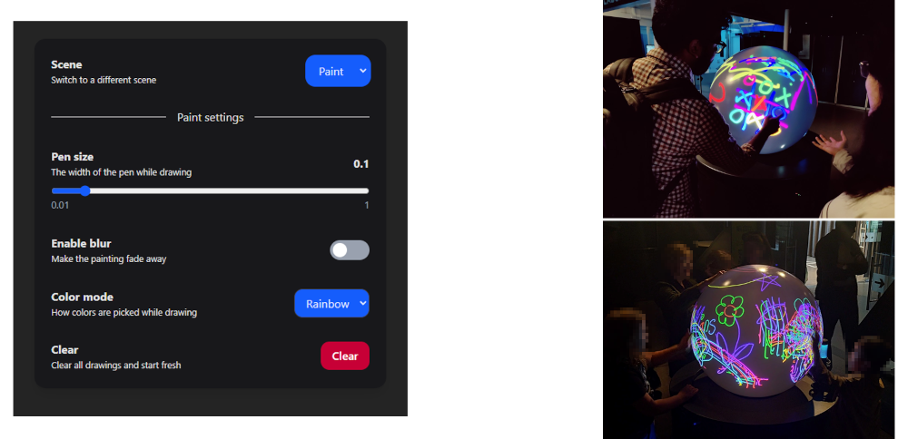
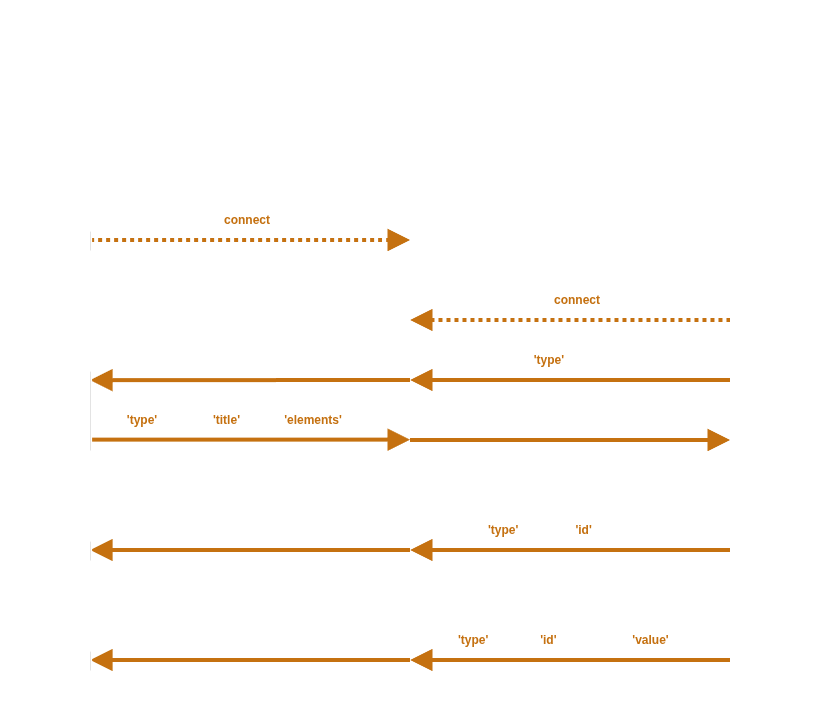

# SocketUI

SocketUI is a remote control system that allows users to control TellUs applications from their smartphone over a local network.

## Project Structure

- **[Backend](backend/README.md)** - Python WebSocket server + HTTP server for frontend
- **[Frontend](frontend/README.md)** - Vite + React control panel. The [UI configuration protocol](frontend/README.md#protocol) is specified here
- **build.bat** - Build script that bundles the frontend and backend into an exe

## How to use in your application

Follow these steps to integrate SocketUI into your TellUs application:

1. Build SocketUI (see [how to build](#how-to-build))

2. Run SocketUI.exe and open [http://localhost:7000/](http://localhost:7000/) in your browser

3. Connect your application by creating a WebSocket connection to [ws://localhost:7000/ws](ws://localhost:7000/ws)

4. Listen for `{ "type": "request" }`. This [request message](frontend/README.md#request-message) is sent by SocketUI whenever it loads or reconnects, requesting a config.

5. Send `{ "type": "config", "title": "My config", "elements": [{ "type": "button", "id": "my_button", "text": "Click me" }] }`. This [config message](frontend/README.md#config-message) specifies the UI elements you want to display.

6. Listen for `{ "type": "button", "id": "my_button" }` to handle user interactions. This [button event message](frontend/README.md#event-message) indicates that the button was pressed.

For a complete reference of all supported UI elements, see the [UI configuration protocol](frontend/README.md#protocol).

## How it works

**Connecting**

1. **Start app**: The TellUs application connects a WebSocket to <ws://localhost:7000/ws>, which connects it to the SocketUI backend.

2. **Open website**: A mobile device, connected to the TellUs wifi, opens <http://localhost:7000> in a web browser. The frontend connects to the backend the same way, then sends a [request message](frontend/README.md#request-message) to the backend, which passes it along to the TellUs application.

3. **Prepare config**: The TellUs application sends a [config message](frontend/README.md#config-message), describing the UI elements it needs (buttons, sliders, dropdowns, switches, etc.)

4. **Render HTML**: The frontend receives the config and updates the webpage to display the specified UI elements.

**Interacting**

1. **Click button**: When the user clicks a button that was specified in the config, the frontend sends a [button event message](frontend/README.md#button-event-message) that includes the button id.

2. **Drag slider**: When the user drags a slider, the frontend sends a [slider event message](frontend/README.md#slider-event-message) that includes the slider id and the slider value.

3. **Action**: The TellUs application receives the event and can perform a specific action based on the button or slider id.

## How to build

### Prerequisites

- [Python](https://www.python.org/downloads/) with `fastapi` and `uvicorn` packages installed
- Node.js and npm

### Build Steps

Run the `build.bat` script in a terminal from the root directory.

This script:

1. Builds the React frontend
2. Moves the compiled frontend into the backend directory
3. Packages everything with PyInstaller to create `backend/dist/SocketUI.exe`
4. Creates `SocketUI.zip` for distribution

## Installation on TellUs Computer

1. **Build SocketUI** using `build.bat` (see above)
2. **Move the zip** containing `SocketUI.exe` to `C:\` or another permanent location on the TellUs computer, then extract the zip
3. **Add to Windows Startup** to ensure SocketUI runs automatically:
   - Press `Win + R`, type `shell:startup`, and press Enter
   - Create a shortcut to `SocketUI.exe` in the startup folder
4. **SocketUI is now ready** - it will run in the background on port 7000 whenever a compatible TellUs application connects
