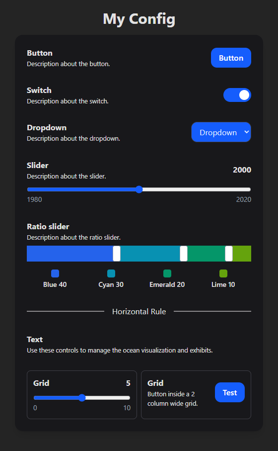
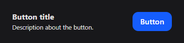

# SocketUI Frontend

<!--  -->


The SocketUI frontend is a dynamic, real-time control panel built with **Vite**, **React**, and **Tailwind CSS**. It communicates with the TellUs application via WebSocket to receive UI configurations and send user interactions.

## How to run locally

To run the frontend in development mode:

```bash
npm install
npm run dev
```

The site will be hosted on `http://localhost:5173`

### Building

To build the frontend for production:

```bash
npm run build
```

The compiled files will be output to the `dist/` folder (which gets bundled with the backend by `build.bat`).

## Protocol

This section describes the complete JSON protocol used by SocketUI. There are 3 types of events:

### Request message

This message is sent by SocketUI upon connecting or refreshing. It

> `{ "type": "request" }`

### Config message

### Button event message

### Slider event message

The frontend displays UI elements based on a configuration JSON sent from the TellUs application. Each element has:

- A `type` field that identifies what kind of element it is
- An `id` field that uniquely identifies the element
- Optional `hint_title` and `hint_text` fields that display descriptive text to the user
- Element-specific configuration fields

## UI elements

### Button



```typescript
{
  type: "button",
  id: string, // Unique element id
  text: string, // The button text
  hint_title?: string, // Optional title about usage
  hint_text?: string, // Optional description about usage
  color?: string // Optional button color ("#FFFFFF")
}
```

**Interaction:**
When clicked, sends:

```typescript
{
  type: "button",
  id: string // Unique element id
}
```

### Dropdown

A dropdown select element with multiple options.

**Config:**

```typescript
{
  type: "dropdown",
  id: string,
  options: string[],
  value: string,
  hint_title?: string,
  hint_text?: string,
  color?: string
}
```

- `options` - Array of available options to select from
- `value` - The currently selected option
- `color` - (Optional) CSS color value for the dropdown
- `hint_title` and `hint_text` - (Optional) Descriptive text displayed to the left

**Interaction:**
When the selection changes, sends:

```typescript
{
  type: "dropdown",
  id: string,
  value: string
}
```

### Slider

A single-value range input slider with customizable min, max, and step values.

**Config:**

```typescript
{
  type: "slider",
  id: string,
  value: number,
  min: number,
  max: number,
  step?: number,
  hint_title?: string,
  hint_text?: string,
  color?: string
}
```

- `value` - The current slider value
- `min` - Minimum allowed value
- `max` - Maximum allowed value
- `step` - (Optional) Step size for increments (default: 1)
- `color` - (Optional) CSS color value for the slider track
- `hint_title` and `hint_text` - (Optional) Descriptive text displayed to the left

**Interaction:**
When the slider is moved, sends:

```typescript
{
  type: "slider",
  id: string,
  value: number
}
```

### Ratio Slider

A specialized multi-value slider that maintains a constant total while allowing you to adjust the ratio between multiple values by dragging divider knobs.

**Config:**

```typescript
{
  type: "ratio_slider",
  id: string,
  values: {
    name: string,
    value: number,
    color: string
  }[],
  hint_title?: string,
  hint_text?: string
}
```

- `values` - Array of value objects, each containing:
  - `name` - Label for this value segment
  - `value` - Current numeric value
  - `color` - CSS color value for this segment
- `hint_title` and `hint_text` - (Optional) Descriptive text displayed to the left

**Interaction:**
When a knob is dragged, sends:

```typescript
{
  type: "ratio_slider",
  id: string,
  values: number[]
}
```

The `values` array contains the new numeric values in the same order as the configuration, with the sum always equal to the original sum.

### Switch

A boolean toggle switch element.

**Config:**

```typescript
{
  type: "switch",
  id: string,
  value: boolean,
  hint_title?: string,
  hint_text?: string,
  color?: string
}
```

- `value` - Current boolean state (true = on, false = off)
- `color` - (Optional) CSS color value for the switch when active
- `hint_title` and `hint_text` - (Optional) Descriptive text displayed to the left

**Interaction:**
When toggled, sends:

```typescript
{
  type: "switch",
  id: string,
  value: boolean
}
```

### Text

A text-only element for displaying feedback, debug information, or section headers.

**Config:**

```typescript
{
  type: "text",
  id: string,
  hint_title?: string,
  hint_text?: string
}
```

- `hint_title` - (Optional) Bold title text displayed
- `hint_text` - (Optional) Regular text displayed below the title

**Note:** Text elements are non-interactive and do not send any events when displayed.

### Horizontal Rule

A visual separator element (HTML `<hr>`) used to visually separate sections.

**Config:**

```typescript
{
  type: "hr",
  id: string,
  hint_title?: string
}
```

- `hint_title` - (Optional) Text displayed in the center of the horizontal rule to label the section

**Note:** Hr elements are non-interactive and do not send any events.

### Grid

A layout container that arranges other UI elements in a grid with a specified number of columns. Any of the previously mentioned elements can be nested inside a grid.

**Config:**

```typescript
{
  type: "grid",
  id: string,
  columns: number,
  elements: UiElement[]
}
```

- `columns` - Number of columns in the grid layout
- `elements` - Array of any UI element types (button, switch, slider, dropdown, text, hr, or even nested grids)

**Example:**

```json
{
	"type": "grid",
	"id": "button_grid",
	"columns": 3,
	"elements": [
		{ "type": "button", "id": "btn1", "text": "Button 1" },
		{ "type": "button", "id": "btn2", "text": "Button 2" },
		{ "type": "button", "id": "btn3", "text": "Button 3" }
	]
}
```

## Example Configuration

Here's a complete example of a TellUs application sending a configuration to the frontend:

```json
{
	"type": "config",
	"title": "Interactive Globe Controls",
	"elements": [
		{
			"type": "text",
			"id": "main_title",
			"hint_title": "Globe Mode",
			"hint_text": "Select the visualization mode"
		},
		{
			"type": "dropdown",
			"id": "mode_selector",
			"options": ["Continents", "Countries", "Cities"],
			"value": "Continents"
		},
		{ "type": "hr", "id": "hr1", "hint_title": "Appearance" },
		{
			"type": "switch",
			"id": "show_labels",
			"value": true,
			"color": "#3b82f6",
			"hint_title": "Labels",
			"hint_text": "Show location labels on globe"
		},
		{
			"type": "slider",
			"id": "rotation_speed",
			"value": 50,
			"min": 0,
			"max": 100,
			"color": "#ef4444",
			"hint_title": "Rotation Speed"
		},
		{ "type": "hr", "id": "hr2", "hint_title": "Actions" },
		{
			"type": "grid",
			"id": "action_buttons",
			"columns": 2,
			"elements": [
				{
					"type": "button",
					"id": "reset",
					"text": "Reset",
					"color": "#6b7280"
				},
				{
					"type": "button",
					"id": "capture",
					"text": "Capture",
					"color": "#10b981"
				}
			]
		}
	]
}
```

<details>

<summary>Tips for collapsed sections</summary>

### You can add a header

You can add text within a collapsed section.

You can add an image or a code block, too.

```ruby
   puts "Hello World"
```

</details>
