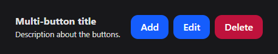
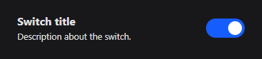
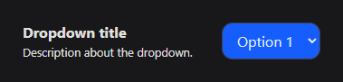
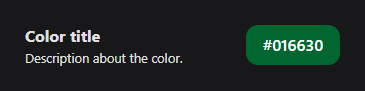
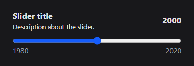
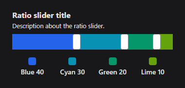
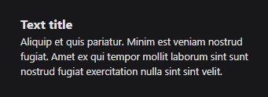
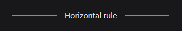
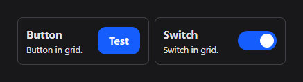

# SocketUI Frontend

The SocketUI frontend is a dynamic, real-time control panel built with **Vite**, **React**, and **Tailwind CSS**. It communicates with the TellUs application via WebSocket to receive UI configurations and send user interactions.

## Protocol

This section describes the complete JSON protocol used by SocketUI. There are 3 types of messages: [request](#request-message), [config](#config-message), [event](#event-message).

### Request message

A **request message** is sent by SocketUI frontend upon connecting or refreshing. The message gets sent to the TellUs application, requesting it to send a **config message** back.

```jsonc
{
	"type": "request",
}
```

### Config message

A **config message** is sent by the TellUs application to specify what UI elements to display on the SocketUI frontend.

See [UI elements](#ui-elements) for more details about all available elements and their configuration.

```jsonc
{
	"type": "config",
	"title": "My config", // Optional title at the top
	"elements": [
		{ "type": "button", "id": "start_button", ... }, // See button element
		{ "type": "slider", "id": "size_slider", ... }, // See slider element
		{ "type": "dropdown", "id": "favorite_fruit", ... }, // See dropdown element
		...
	]
}
```

### Event message

When an element is interacted with, SocketUI sends an event message matching the type of the UI element. For instance, clicking a button element results in a button event message.

The `type` and `id` properties in an event message matches the type and id of an element in the config. The `value` property is provided for UI elements that can be modified, such as a slider with a numeric value or a dropdown with a string value.

```jsonc
{
	"type": "dropdown", // The type of UI element interacted with
	"id": "favorite_fruit", // Unique element id
	"value": "Apple", // Dropdown returns a string value
}
```

## UI elements

This section lists all UI elements allowed in the [config message](#config-message) elements list.

Each element requires a unique `id` to track interactions.

---

### Button element


```jsonc
{
	"type": "button",
	"id": "my_button",
	"text": "Button",
	"hint_title": "Button title", // Optional
	"hint_text": "Description about the button", // Optional
	"color": "#ffffff", // Optional
}
```

#### Button event message

When a button is clicked, SocketUI sends:

```jsonc
{
	"type": "button",
	"id": "my_button",
}
```

---

### Multi-button element



```jsonc
{
	"type": "multi_button",
	"buttons": [
		{
			"id": "my_button",
			"text": "Button",
			"color": "#ffffff", // Optional
		},
		...
	],
	"hint_title": "Multi-button title", // Optional
	"hint_text": "Description about the buttons.", // Optional
}
```

#### Multi-button event message

When one of the buttons is clicked, SocketUI sends a [button event message](#button-event-message):

```jsonc
{
	"type": "button",
	"id": "my_button",
}
```

---

### Switch element



```jsonc
{
	"type": "switch",
	"id": "my_switch",
	"value": true,
	"hint_title": "Switch title", // Optional
	"hint_text": "Description about the switch", // Optional
	"color": "#ffffff", // Optional
}
```

#### Switch event message

When toggled, SocketUI sends:

```jsonc
{
	"type": "switch",
	"id": "my_switch",
	"value": true, // Switch state
}
```

---

### Dropdown element



```jsonc
{
	"type": "dropdown",
	"id": "my_dropdown",
	"options": ["Option 1", "Option 2", "Option 3"],
	"value": "Option 1",
	"hint_title": "Dropdown title", // Optional
	"hint_text": "Description about the dropdown", // Optional
	"color": "#ffffff", // Optional
}
```

#### Dropdown event message

When the selection changes, SocketUI sends:

```jsonc
{
	"type": "dropdown",
	"id": "my_dropdown",
	"value": "Option 1", // Dropdown selection
}
```

---

### Color picker element



```jsonc
{
	"type": "color",
	"id": "my_color",
	"value": "#ff0000", // Hex color
	"hint_title": "Color title", // Optional
	"hint_text": "Description about the color", // Optional
}
```

#### Color event message

When the color changes, SocketUI sends:

```jsonc
{
	"type": "color",
	"id": "my_color",
	"value": "#00ff00", // Color value as hex
}
```

---

### Slider element



```jsonc
{
	"type": "slider",
	"id": "my_slider",
	"value": 50,
	"min": 0,
	"max": 100,
	"step": 1, // Optional
	"hint_title": "Slider title", // Optional
	"hint_text": "Description about the slider", // Optional
	"color": "#ffffff", // Optional
}
```

#### Slider event message

When the slider is moved, SocketUI sends:

```jsonc
{
	"type": "slider",
	"id": "my_slider",
	"value": 50, // Slider value
}
```

---

### Ratio slider element

The ratio slider element is a multi-slider, allowing you to specify the ratio between multiple values. The total is always preserved when moving the slider knobs.



```jsonc
{
	"type": "ratio_slider",
	"id": "my_ratio_slider",
	"values": [
		{
			"name": "Blue",
			"value": 10,
			"color": "#2563eb"
		},
		...
	],
	"hint_title": "Ratio title", // Optional
	"hint_text": "Description about the ratio slider" // Optional
}
```

#### Ratio Slider event message

When a knob is dragged, SocketUI sends:

```jsonc
{
	"type": "ratio_slider",
	"id": "my_ratio_slider",
	"values": [10, 20, 30, 40], // Ratio values, same order as in `values` array
}
```

---

### Text element

Text elements can be used to send feedback to the user about the state of the TellUs application.



```jsonc
{
	"type": "text",
	"hint_title": "Text title", // Optional
	"hint_text": "Text content", // Optional
}
```

Text elements are non-interactive and does not require an `id`, nor sends any events.

---

### HR element

HR elements can be used to add separation between sections of UI elements.



```jsonc
{
	"type": "hr",
	"hint_title": "Section label", // Optional label
}
```

HR elements are non-interactive and does not require an `id`, nor sends any events.

---

### Grid element

Grid elements are layout containers that arrange other UI elements in a grid with a specified number of columns. Any previously mentioned element type can be nested inside a grid, including other grids.

Grid cells have a minimum width to avoid squishing. Therefore, on narrow devices, the grid columns will be automatically limited to 2 or 3.



```jsonc
{
	"type": "grid",
	"columns": 2, // 2 or 3 columns works best
	"elements": [
		{ "type": "button", ... },
		{ "type": "slider", ... },
		...
	]
}
```

Grid elements are non-interactive and does not require an `id`, nor sends any events.

## How to run locally

To run the frontend in development mode:

```bash
npm install
npm run dev
```

The site will be hosted on `http://localhost:5173`

### Building

To build the frontend for production:

```bash
npm run build
```

The compiled files will be output to the `dist/` folder (which gets bundled with the backend by `build.bat`).
